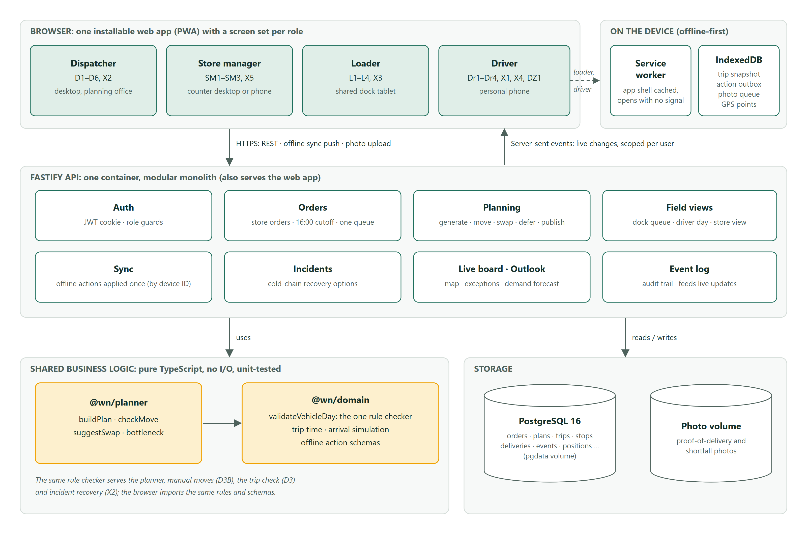
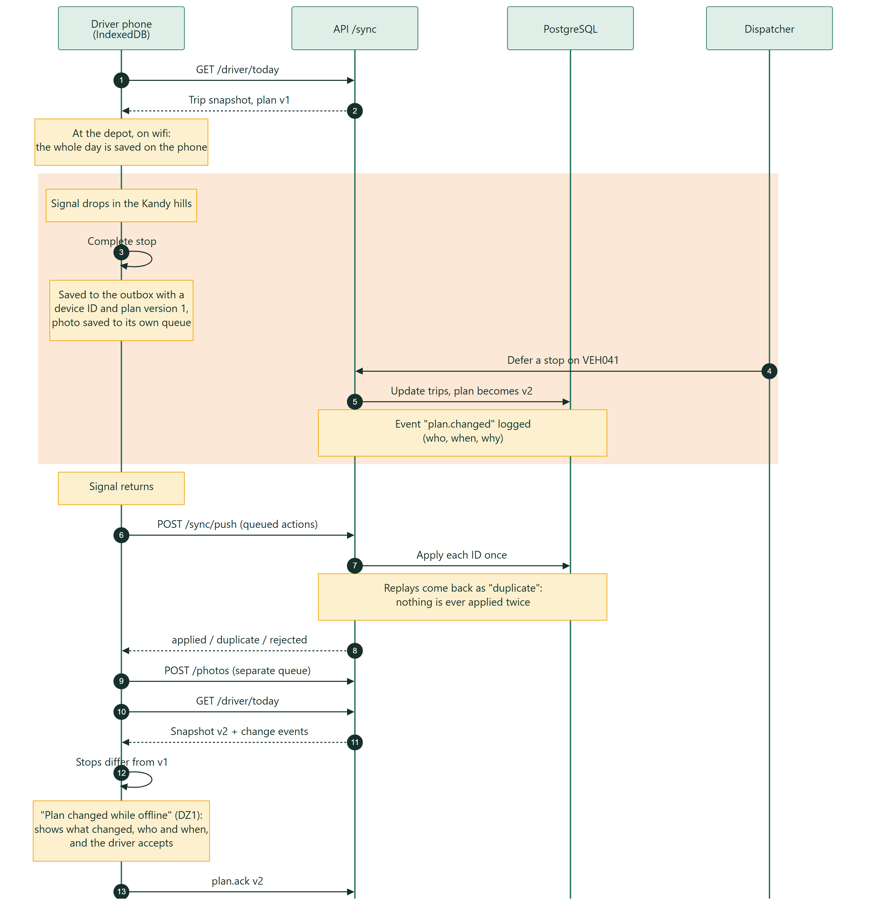
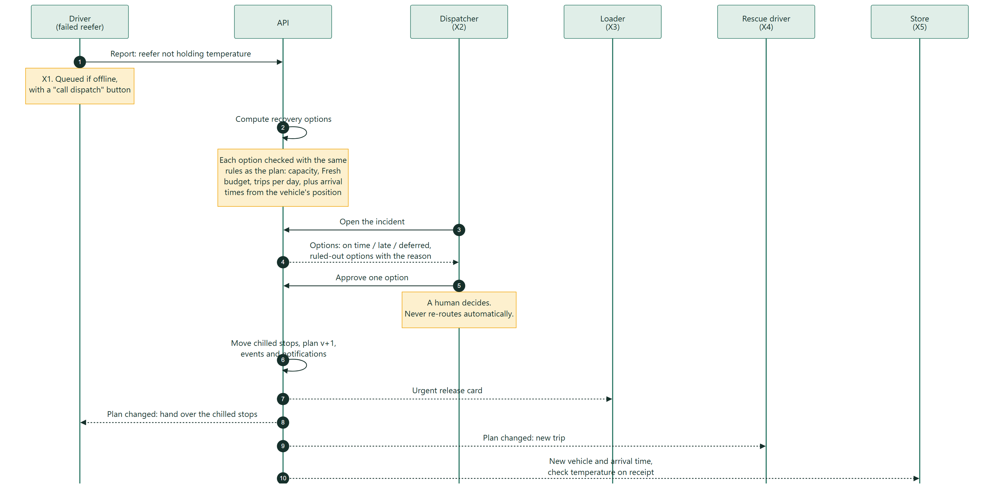
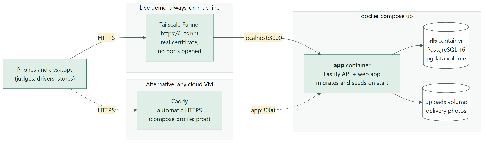

# Architecture

Waypoint Nexus is a **modular monolith**: one deployable Fastify server that serves the API and the built single-page app, backed by PostgreSQL. Two pure TypeScript packages hold the business rules and the planner. They have no I/O, are unit-tested on their own, and are shared by the server and the browser.

## Components

Diagram source: [`src/component-diagram.svg`](src/component-diagram.svg) (hand-drawn SVG).

| Decision | Why |
|---|---|
| **One rule checker** (`@wn/domain.validateVehicleDay`) used by the planner, the manual-move validator, the trip-check screen and incident recovery | A plan can never contain a violation the UI didn't explain; "explainable assistance" (the design's core tradeoff) holds by construction |
| **Pure planner package** | Deterministic, fast (about 15 ms for a day), property-tested on random networks; could move to a worker unchanged |
| **Modular monolith, not services** | Right size for the team and the timeline; module boundaries (`apps/api/src/services/*`) keep it explainable |
| **SPA served by the API, same origin** | Simple cookies and service-worker scope; one container to run |
| **Server-sent events** for live updates | One-way push is all any screen needs; plain HTTP through any proxy; clients just refetch |
| **Times as minutes since midnight** (Asia/Colombo) | Matches the datasets' HH:MM convention and removes a class of timezone bugs |
| **Installable PWA, not native apps** | The booklet requires a responsive web app; our design explicitly chose an installable web app |

## Offline and reconciliation (dead zone, DZ1)

Principle: **field records are append-only facts; plans are server-authoritative and versioned.**

Diagram source: [`src/offline-sync-sequence.mmd`](src/offline-sync-sequence.mmd) (Mermaid).

- **Idempotency.** Every mutation carries a client-generated UUID. `sync_mutations` stores the result per UUID, so a retried batch after a dropped connection returns `duplicate` and is never applied twice. Each mutation runs in its own transaction, so one bad record never blocks the rest.
- **Conflicts.** A proof of delivery is always accepted, because the goods physically arrived. If the plan had moved that stop to another vehicle, the server keeps the delivery **and** raises a `double_serve` exception on the dispatcher's live board. Nothing is silently dropped.
- **Optimistic UI.** Screens show the server snapshot overlaid with this device's queued actions (`apps/web/src/offline/field.ts`), so the driver sees the stop done immediately.
- **No Background Sync dependency** (iOS has none). The outbox flushes on reconnect, every 15 s, when the app regains focus and after each action.
- **Trust.** The sync screen (Dr4) lists exactly what is queued and synced. The dispatcher's board shows each driver's last sync as a normal state.
- **Demo aid.** Tapping the signal badge toggles *Simulate no signal*. Nothing leaves the device while it is on.

## Publishing a plan and the cold-chain recovery

Diagram source: [`src/cold-chain-recovery-sequence.mmd`](src/cold-chain-recovery-sequence.mmd) (Mermaid).

## Vehicle location from the driver's phone

There is no in-truck telematics; the driver's phone is the GPS. While a trip is in progress and the app is open, the browser's geolocation API reports fixes. They are throttled to one per 2 minutes or 300 m, plus a fix at trip start and at every completed stop, stored in IndexedDB (`pings`) and uploaded in batches to `POST /api/driver/positions` (UUID-keyed, so retries are harmless). Positions recorded in a dead zone arrive later as a trail. Browsers don't allow background tracking, which matches the design: the phone is used when stopped. The driver can switch sharing off on Dr1. The live map uses the newest fix if it is under 30 minutes old and inside Sri Lanka; otherwise it shows the vehicle at its last recorded stop, and the tooltip always says how old the position is.

## Events

Every state change writes one row to `events` (actor, type, plan version, scope, payload). That single log:
- feeds **SSE** fan-out, filtered per user by scope (depot, vehicle, outlet, role);
- provides the **who, when and why** text on DZ1 and X4;
- is the **audit trail** the brief asks for ("deferrals lack a clear record").

## Security

- JWT in an httpOnly, SameSite=Lax cookie (Secure over HTTPS); passwords hashed with bcrypt.
- Every route has a role guard. Mutations are role-checked again per type in the sync handler, and a store manager can only confirm receipt for their own outlet.
- All request bodies are validated with zod. Photo uploads are limited to JPEG/PNG/WebP, at most 8 MB, stored under device-generated UUIDs.

## Deployment

Diagram source: [`src/deployment.mmd`](src/deployment.mmd) (Mermaid).

`docker compose up` runs `db` and `app`. On first start the app runs the migrations and seeds the datasets and the demo day. Both containers listen only on the machine itself (`127.0.0.1`); the database is never exposed.

- **Live demo:** the stack runs on a dedicated always-on machine, published at a stable `https://…ts.net` address by **Tailscale Funnel** (`tailscale funnel --bg 3000`). The certificate is real and no router ports are opened.
- **Cloud VM alternative:** `docker compose --profile prod up -d --build` adds **Caddy**, which obtains an HTTPS certificate for `SITE_ADDRESS` automatically.

HTTPS is required either way: the PWA's offline mode, camera and GPS only work on secure origins.
