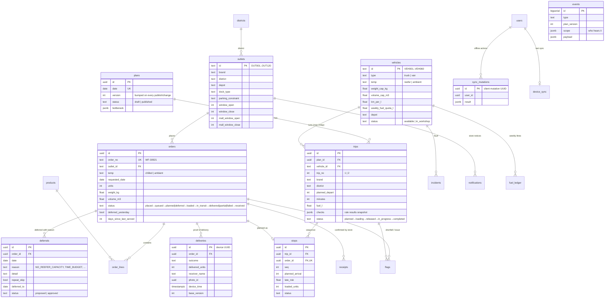
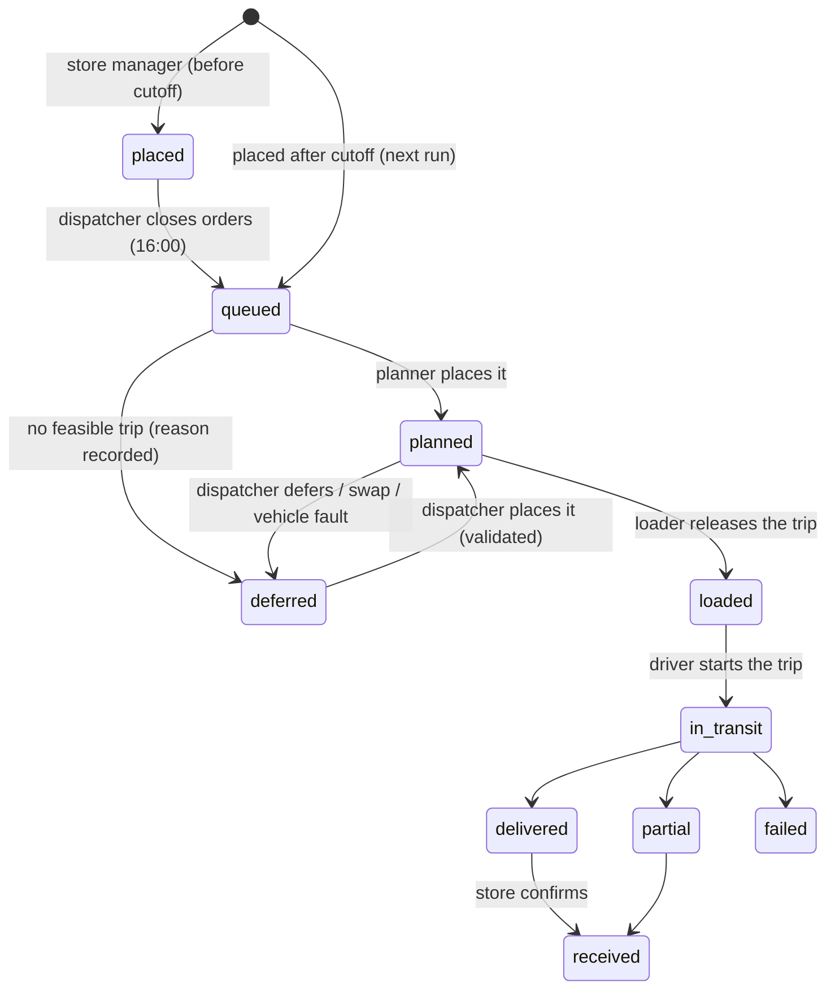

# Data model

PostgreSQL 16, schema in [`apps/api/src/db/schema.ts`](../apps/api/src/db/schema.ts) (Drizzle), migrations in `apps/api/drizzle/`.

Conventions: clock times are **integer minutes since midnight, Asia/Colombo** (e.g. 05:30 → 330), matching the datasets' `HH:MM`. Calendar days are `date`. Instants (when something happened on a device or the server) are `timestamptz`. Rows created on a device (deliveries, flags, receipts, incidents, photos) use **device-generated UUIDs** as primary keys, which is part of what makes offline sync idempotent.

## Tables by purpose

| Group | Tables | Notes |
|---|---|---|
| Reference (seeded from the booklet CSVs) | `outlets`, `vehicles`, `districts` (district_travel), `calendar_days`, `service_allowances`, `traffic_speed`, `road_conditions` | Loaded verbatim. Outlets also get a display name from their district's towns, and access notes |
| Derived from history | `demand_history` (weekly m³ per depot and brand, from `deliveries_train.csv`), `delay_stats` (arrival delay mean and sd per district and stop position, from `route_legs_train.csv`), `fuel_ledger` (litres used earlier in the week) | Feed the capacity outlook, late risk and the fuel-quota rule |
| People | `users` | Role plus a link to an outlet, a vehicle or a depot |
| Ordering | `orders`, `order_lines`, `products` | Stores order in cases and crates; weight and volume come from the catalogue |
| Planning | `plans`, `trips`, `stops`, `deferrals` | One plan per delivery date; `version` drives reconciliation on devices |
| Execution | `flags`, `deliveries`, `receipts`, `incidents`, `photos`, `vehicle_positions` (phone GPS fixes) | Append-only facts from the field, keyed by device UUIDs |
| Infrastructure | `events`, `notifications`, `sync_mutations`, `device_sync`, `app_state` | Audit log and SSE source, store notices, idempotency, last-sync tracking, demo clock |

## Order lifecycle

